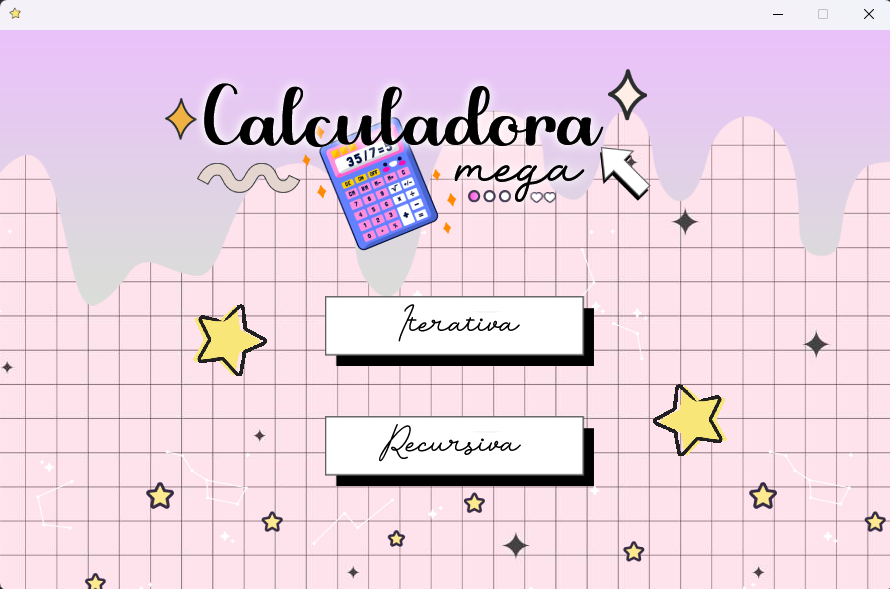
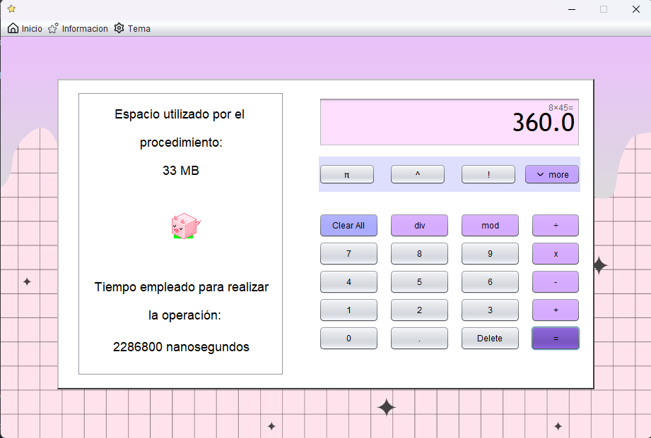
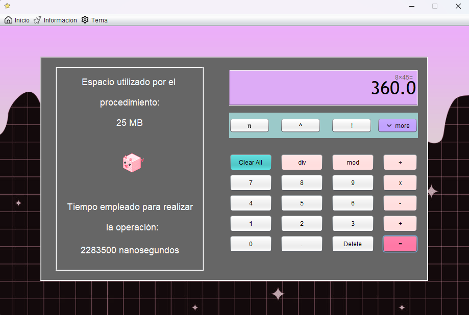

# 🧮 Calculadora Mega

> **Calculadora Mega** es una aplicación de escritorio desarrollada en **Java (Swing)** que implementa una **calculadora científica avanzada**, permitiendo comparar **operaciones iterativas y recursivas**, junto con métricas de **tiempo de ejecución** y **uso de memoria**.

---

## ✨ Características principales

- 🔢 Operaciones matemáticas básicas y científicas
- 🔁 Doble implementación: **Iterativa y Recursiva**
- ⏱️ Medición de **tiempo de ejecución**
- 🧠 Cálculo de **memoria utilizada**
- 🎨 Interfaz gráfica intuitiva con **Swing**
- 🌗 **Modo Claro / Modo Oscuro**
- 🎧 **Sonidos integrados** para acciones
- 🧩 Arquitectura modular y extensible

---

## 🧠 Operaciones disponibles

### ➕ Operaciones básicas
- Suma  
- Resta  
- Multiplicación  
- División  
- Módulo  
- División entera  

### 📐 Operaciones científicas
- Potencia  
- Raíz cuadrada  
- Factorial  
- Combinatoria (**nCr**)  

### 📊 Trigonometría
- Seno  
- Coseno  
- Tangente  

---

## 🔁 Comparación Iterativa vs Recursiva

La calculadora permite ejecutar cada operación usando:

- 🔂 **Implementación iterativa**
- 🔁 **Implementación recursiva**

Mostrando al usuario:

- ⏱️ Tiempo exacto de ejecución
- 🧠 Consumo de memoria
- ⚖️ Diferencias de rendimiento entre enfoques

---

## 👀 Vista previa

> 📌 Las imágenes/GIFs deben estar subidas al repositorio para que se muestren correctamente.

### 📩 Menú principal

### ⛅ Modo Claro

### 🌒 Modo Oscuro

---

## 🖥️ Tecnologías utilizadas

- **Java SE**
- **Java Swing**
- **Apache NetBeans**
- **Eventos y Listeners**
- **System.nanoTime()**
- **Runtime.getRuntime()**
- **Arquitectura Iterativa y Recursiva**

---

## ▶️ Cómo ejecutar el proyecto

### 🔹 Opción 1 – Ejecutar desde NetBeans

#### ✅ Requisitos
- **JDK 17 o superior**
- **Apache NetBeans 15 o superior**

#### 📁 Importar el proyecto
1. Abre NetBeans  
2. `File → Open Project`  
3. Selecciona la carpeta **Calculadora_Mega**  
4. Presiona **Open Project**

#### ▶️ Ejecutar
- Clic derecho sobre el proyecto → **Run**
- O presiona **F6**

---

### 🔹 Opción 2 – Uso de la aplicación

- Usa botones o teclado (NumPad soportado)
- Selecciona **modo iterativo o recursivo**
- Ejecuta operaciones básicas o científicas
- Observa métricas de tiempo y memoria

---

## 📌 Objetivo del proyecto

Este proyecto tiene como finalidad **explorar y comparar** dos paradigmas fundamentales de la programación:

- 🔁 **Recursividad**
- 🔂 **Iteración**

Permitindo analizar diferencias en:

- ⚡ Velocidad de ejecución  
- 🧠 Uso de memoria  
- 🧩 Complejidad de implementación  

---

## 👩‍💻 Autora

**Andrea De la Ossa**  
🎓 Estudiante de Ingeniería de Sistemas  
💻 Desarrollo en Java  
🎯 Interés en interfaces gráficas y análisis de rendimiento

📍 Proyecto académico / personal  
📅 2025

